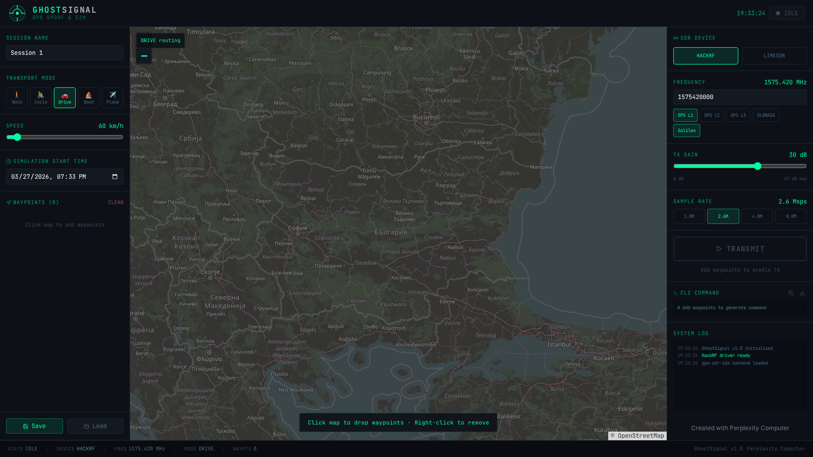
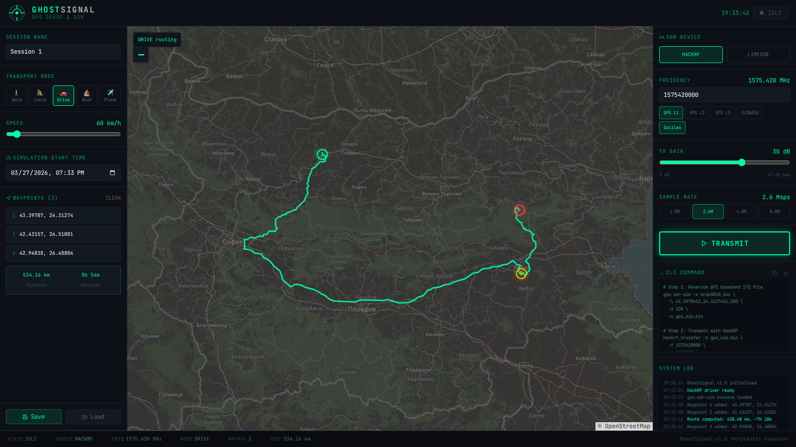
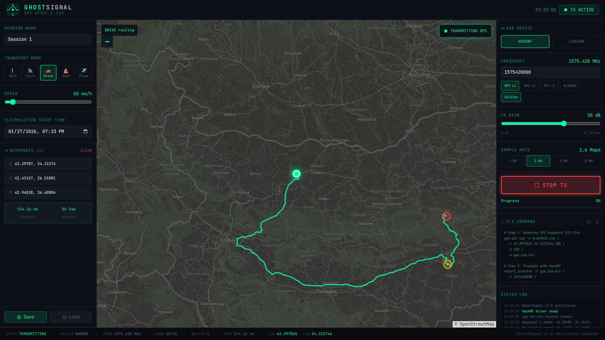

# GhostSignal 🛰️

**GPS Spoofing & Route Simulation GUI for HackRF One and LimeSDR**

GhostSignal is a professional desktop application for generating and transmitting spoofed GPS signals using SDR hardware. It provides a visual interface for picking exact coordinates on a map, designing multi-waypoint routes, selecting transport modes (walk, cycle, drive, boat, plane), and controlling HackRF / LimeSDR transmission parameters — all in one place.

> ⚠️ **Legal notice:** GPS spoofing is regulated or illegal in most jurisdictions outside of shielded RF labs. This tool is intended strictly for **authorized research, development, and testing environments** such as Faraday-cage labs, official drone testing sites, and academic research with proper authorization. Never transmit without explicit legal permission.

---

## Screenshots

### Idle — Map & Controls


### Route Simulation — Multi-Waypoint Drive Route


### Transmitting — Live Position Playback


---

## Features

- 🗺️ **Interactive map** — click to place waypoints, drag to reposition them
- 🛣️ **Real road routing** via OSRM (OpenStreetMap) — walk, cycle, drive modes use actual road geometry
- ✈️ **All transport modes** — Walk / Cycle / Drive / Boat / Plane (straight-line for boat/plane)
- 📅 **Simulation start time** — set exact GPS timestamp for the simulation
- 📡 **HackRF One & LimeSDR** — switchable device, configurable TX gain (0–47 dB), frequency, and sample rate
- 🔢 **GPS frequency presets** — L1 (1575.42 MHz), L2, L5, GLONASS
- 🖥️ **Auto-generated CLI script** — copy or download a ready-to-run `gps-sdr-sim` + `hackrf_transfer` shell script
- 💾 **Session save/load** — save waypoints, settings, and routes as JSON files
- 📊 **Live position playback** — moving dot on the map follows the route during simulation
- 🖥️ **Cross-platform** — Linux and Windows (PyQt6)

---

## Architecture

```
┌─────────────────────────────────────────────────┐
│                  GhostSignal GUI                │
│  ┌───────────┐  ┌──────────────┐  ┌──────────┐ │
│  │  Sidebar  │  │  Map (OSM)   │  │  HackRF  │ │
│  │ Transport │  │  Leaflet.js  │  │  Panel   │ │
│  │ Waypoints │  │  OSRM Route  │  │  CLI Gen │ │
│  │ Save/Load │  │  Live Pos    │  │  Log     │ │
│  └───────────┘  └──────────────┘  └──────────┘ │
└──────────────────────┬──────────────────────────┘
                       │ generates
          ┌────────────▼────────────┐
          │       Shell Script      │
          │  gps-sdr-sim → .bin     │
          │  hackrf_transfer → TX   │
          └─────────────────────────┘
```

---

## Requirements

### System dependencies

| Tool | Version | Purpose |
|------|---------|---------|
| Python | ≥ 3.11 | Runtime |
| PyQt6 | ≥ 6.6.0 | GUI framework |
| PyQt6-WebEngine | ≥ 6.6.0 | Embedded map |
| [gps-sdr-sim](https://github.com/osqzss/gps-sdr-sim) | latest | GPS I/Q baseband generator |
| [hackrf](https://github.com/greatscottgadgets/hackrf) | latest | HackRF One tools (`hackrf_transfer`) |
| LimeSuite / SoapySDR | optional | LimeSDR support |

### Python packages

```
PyQt6>=6.6.0
PyQt6-WebEngine>=6.6.0
requests>=2.31.0
```

---

## Installation

### Linux (Ubuntu / Debian)

```bash
# 1. Install system packages
sudo apt update
sudo apt install -y python3 python3-pip python3-venv git build-essential cmake

# 2. Install HackRF tools
sudo apt install -y hackrf

# 3. Build gps-sdr-sim from source
git clone https://github.com/osqzss/gps-sdr-sim.git
cd gps-sdr-sim
gcc gpssim.c -lm -O3 -o gps-sdr-sim
sudo cp gps-sdr-sim /usr/local/bin/
cd ..

# 4. Clone GhostSignal
git clone https://github.com/snb9042/ghostsignal.git
cd ghostsignal

# 5. Create virtual environment and install Python deps
python3 -m venv venv
source venv/bin/activate
pip install -r requirements.txt

# 6. Run
python ghostsignal.py
```

### Windows (10 / 11)

```powershell
# 1. Install Python 3.11+ from https://python.org

# 2. Install HackRF Windows drivers from:
#    https://github.com/greatscottgadgets/hackrf/releases

# 3. Build or download gps-sdr-sim:
#    https://github.com/osqzss/gps-sdr-sim (pre-built .exe in releases)
#    Add the folder to your PATH

# 4. Clone GhostSignal
git clone https://github.com/snb9042/ghostsignal.git
cd ghostsignal

# 5. Install Python deps
pip install -r requirements.txt

# 6. Run
python ghostsignal.py
```

### LimeSDR (optional)

```bash
# Install LimeSuite
sudo apt install -y limesuite soapysdr-tools soapysdr-module-lms7

# Verify
SoapySDRUtil --find
```

---

## How to Use

### 1. Place waypoints on the map

Click anywhere on the map to drop a waypoint. Each click adds a numbered marker:
- **Green** = start point
- **Yellow** = intermediate points  
- **Red** = end point

Drag any marker to reposition it. Use the **CLEAR** button to remove all waypoints.

### 2. Select transport mode

Choose from the left sidebar:
| Mode | Routing | Default Speed |
|------|---------|--------------|
| 🚶 Walk | Road footpaths | 5 km/h |
| 🚴 Cycle | Cycling paths | 15 km/h |
| 🚗 Drive | Road network | 60 km/h |
| ⛵ Boat | Straight line | 25 km/h |
| ✈ Plane | Straight line | 800 km/h |

The route is automatically fetched from OSRM and drawn on the map. Distance and estimated duration are shown below the waypoint list.

### 3. Set simulation start time

Use the **Simulation Start Time** field to set the exact GPS timestamp your receiver will see. This is passed to `gps-sdr-sim` as the `-T` parameter.

### 4. Configure SDR parameters

In the right panel:
- **Device** — HackRF One or LimeSDR
- **Frequency** — Use presets (L1, L2, L5, GLONASS) or type a custom Hz value
- **TX Gain** — 0–47 dB (HackRF). Start at 30 dB for testing in a shielded environment
- **Sample Rate** — 2.6 Msps is the standard for GPS L1

### 5. Generate the CLI script

The **CLI Command** tab auto-generates the exact shell commands needed:

```bash
# Step 1: Generate GPS I/Q baseband
gps-sdr-sim -e brdc.nav \
  -l 42.69751,23.32415,100 \
  -T 2026/03/27,19:00:00 \
  -d 300 \
  -o gps_sim.bin

# Step 2: Transmit with HackRF
hackrf_transfer -t gps_sim.bin \
  -f 1575420000 \
  -s 2600000 \
  -a 1 -x 30 \
  -R
```

Click **Copy** or **Save .sh** to export the script. Download a RINEX navigation file (`.nav`) from [CDDIS NASA](https://cddis.nasa.gov/archive/gnss/data/current/) or [IGS](https://igs.org/products/).

### 6. Transmit

Click **▶ TRANSMIT**. The GUI will:
1. Start the route playback animation (moving dot on map)
2. Show live lat/lng in the status bar
3. Show progress for the full route duration

Click **■ STOP TX** to halt.

### 7. Save / Load sessions

Use **Save** and **Load** buttons to persist your waypoints, route, and SDR settings as a `.json` file.

---

## Environment Variables

Override default tool paths if they are not in `PATH`:

```bash
export GPS_SDR_SIM=/path/to/gps-sdr-sim
export HACKRF_TRANSFER=/path/to/hackrf_transfer
export LIMESDR_TX=/path/to/SoapySDRUtil
```

---

## Multi-Waypoint Routes

For routes with multiple waypoints, GhostSignal generates a starting-point script. For true continuous route simulation, chain multiple `gps-sdr-sim` runs or use a GPS NMEA generator:

```bash
# Example: generate sequential segments
for i in 1 2 3; do
  gps-sdr-sim -e brdc.nav -l $LAT_$i,$LNG_$i,100 -d 60 -o seg_$i.bin
done
cat seg_1.bin seg_2.bin seg_3.bin > full_route.bin
hackrf_transfer -t full_route.bin -f 1575420000 -s 2600000 -a 1 -x 30 -R
```

---

## Troubleshooting

| Problem | Solution |
|---------|---------|
| `hackrf_transfer: command not found` | Install `hackrf` package or add to PATH |
| `gps-sdr-sim: command not found` | Build from source and add to PATH |
| Map not loading | Check internet connection (OSM tiles require network) |
| LimeSDR not detected | Run `SoapySDRUtil --find` to verify driver |
| High CPU on route fetch | OSRM is a free public server — add retry on timeout |
| PyQt6-WebEngine missing | `pip install PyQt6-WebEngine` |

---

## Roadmap (v2)

- [ ] True continuous NMEA route injection (stitch multi-segment I/Q)
- [ ] GLONASS / Galileo / BeiDou multi-constellation support
- [ ] Replay recorded `.nmea` track files
- [ ] Speed variation along route (acceleration / deceleration)
- [ ] Built-in RINEX downloader
- [ ] Docker container for headless operation

---

## Credits

- [gps-sdr-sim](https://github.com/osqzss/gps-sdr-sim) by Takuji Ebinuma — GPS signal generator
- [HackRF](https://github.com/greatscottgadgets/hackrf) by Great Scott Gadgets
- [Leaflet](https://leafletjs.com/) — Interactive maps
- [OpenStreetMap](https://www.openstreetmap.org/) — Map data
- [OSRM](http://project-osrm.org/) — Open Source Routing Machine
- Built with [Perplexity Computer](https://www.perplexity.ai/computer)

---

## License

MIT License — see [LICENSE](LICENSE) for details.
